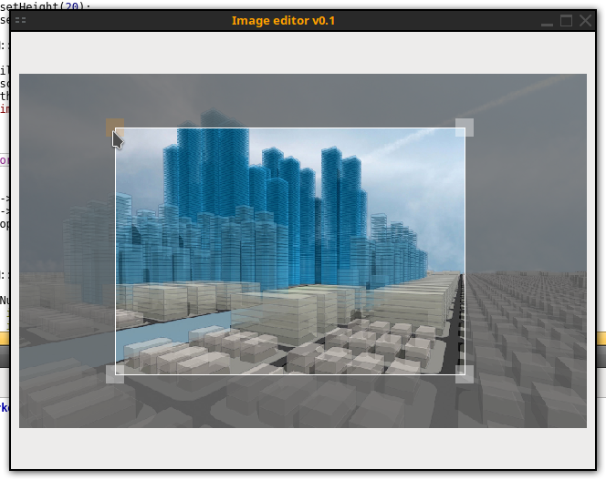

# QT-Libs
My simple qt library


### ImageEditor


#### Example

ui->widget->setCropMode( false );

ui->widget->setImage( "://ico.png" );

ui->widget->setLayerHSV( 1, 0, 0, value );

auto img = ui->widget->getImage();

img.save( "sprite.png", "PNG", 100 );

ui->widget->setLayersCount( 2 );

ui->widget->setImage( "../Horse.png" );

ui->widget->setImage( "../1.png", 1 );

ui->widget->update();


### API

#### Example

```
API::Request request;
request.url = "API_URL";
request.method = API::Method::POST;
request.dataType = API::DataType::JSON;
request.dataList[ "key" ] = "";
request.dataList[ "name" ] = "NAME";
request.dataList[ "data" ] = "data";
API::Response response = API::sendRequest( request );
if( response.error ){
	qDebug()<<response.code<<response.data<<response.errorString;
}else{
	qDebug()<<response.code<<response.data;
}
```
